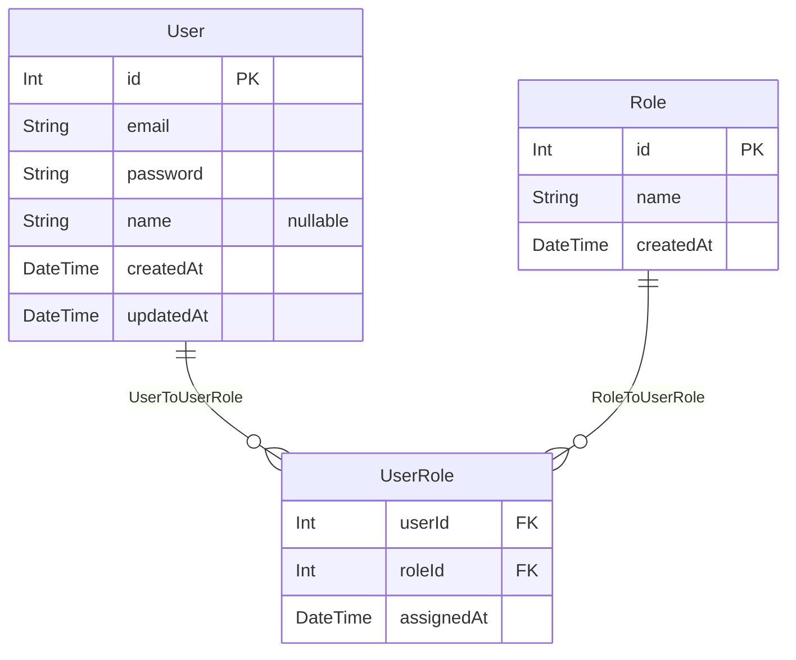

# Cashou — Diagramme entité-relation (ERD)

> Généré automatiquement depuis les schémas Prisma via `bun run docs:erd`.
> Les diagrammes Mermaid ci-dessous sont rendus nativement par GitHub.

## Base applicative — `@cashou/db-app`

_38 modèles, 6 énumérations._

```mermaid
erDiagram
  User {
    String id PK
    String name "nullable"
    String email "nullable"
    Boolean emailVerified
    String image "nullable"
    DateTime createdAt
    DateTime updatedAt
    String username "nullable"
    String discriminator "nullable"
    DateTime lastActivity "nullable"
    Int levelId FK
    String badges "nullable"
    Int points "nullable"
    Int currentStreak
    Int maxStreak
    String expoPushToken "nullable"
  }
  Account {
    String id PK
    String userId FK
    String accountId
    String providerId
    String accessToken "nullable"
    String refreshToken "nullable"
    String idToken "nullable"
    DateTime accessTokenExpiresAt "nullable"
    DateTime refreshTokenExpiresAt "nullable"
    String scope "nullable"
    String password "nullable"
    DateTime createdAt
    DateTime updatedAt
  }
  Session {
    String id PK
    DateTime expiresAt
    String token
    DateTime createdAt
    DateTime updatedAt
    String ipAddress "nullable"
    String userAgent "nullable"
    String userId FK
  }
  Verification {
    String id PK
    String identifier
    String value
    DateTime expiresAt
    DateTime createdAt
    DateTime updatedAt
  }
  Level {
    Int id PK
    String title "nullable"
    Int number "nullable"
    Int duration "nullable"
    Int speed "nullable"
    Int startBalance "nullable"
    Int pointsRequired "nullable"
    Int historyStartDay "nullable"
    DateTime startDate "nullable"
    String description "nullable"
    String tip "nullable"
    DateTime createdAt
    DateTime updatedAt
  }
  Event {
    Int id PK
    String title "nullable"
    String description "nullable"
    Boolean hasImpact "nullable"
    DateTime createdAt
    DateTime updatedAt
  }
  Goal {
    Int id PK
    String title "nullable"
    String description "nullable"
    String successMessage "nullable"
    String failureMessage "nullable"
    String goalType "nullable"
    Float goalValue "nullable"
    DateTime createdAt
    DateTime updatedAt
  }
  LevelGoal {
    Int id PK
    Int levelId FK
    Int goalId FK
    Boolean isMandatory
    DateTime createdAt
    DateTime updatedAt
  }
  LevelAsset {
    Int id PK
    Int levelId FK
    Int assetId FK
    DateTime createdAt
    DateTime updatedAt
  }
  LevelEvent {
    Int id PK
    Int levelId FK
    Int eventId FK
    Int triggerPercent
    Int position
    DateTime createdAt
    DateTime updatedAt
  }
  UserLevelCompletion {
    Int id PK
    String userId FK
    Int levelId FK
    Int stars
    Boolean mandatoryGoalsMet
    Boolean bonusGoalsMet
    Boolean quizPassed
    DateTime completedAt "nullable"
    DateTime createdAt
    DateTime updatedAt
  }
  Market {
    Int id PK
    String title "nullable"
    String description "nullable"
    DateTime createdAt
    DateTime updatedAt
  }
  Submarket {
    Int id PK
    Int marketId FK "nullable"
    Int gameInstanceId FK "nullable"
    String title "nullable"
    String description "nullable"
    SubmarketType type
    DateTime createdAt
    DateTime updatedAt
  }
  Field {
    Int id PK
    Int marketId FK "nullable"
    String name "nullable"
    DateTime createdAt
    DateTime updatedAt
  }
  Asset {
    Int id PK
    String title "nullable"
    String symbol "nullable"
    Int fieldId FK "nullable"
    Float rate "nullable"
    String description "nullable"
    Int marketId FK "nullable"
    Int submarketId FK "nullable"
    Decimal maxAmount "nullable"
    Decimal minAmount "nullable"
    Float managementFee "nullable"
    DateTime createdAt
    DateTime updatedAt
  }
  AssetHistory {
    Int id PK
    Int assetId FK "nullable"
    DateTime timestamp "nullable"
    Decimal value "nullable"
    DateTime createdAt
    DateTime updatedAt
  }
  EventAsset {
    Int id PK
    Int assetId FK "nullable"
    Int eventId FK "nullable"
    DateTime date "nullable"
    Int value "nullable"
    Int volume "nullable"
    DateTime createdAt
    DateTime updatedAt
  }
  Impact {
    Int id PK
    Int eventId FK "nullable"
    Int fieldId FK "nullable"
    Int submarketId FK "nullable"
    Int assetId FK "nullable"
    Float coef "nullable"
    ImpactType impactType
    Decimal amount "nullable"
    DateTime createdAt
    DateTime updatedAt
  }
  GameInstance {
    Int id PK
    String type "nullable"
    String userId FK "nullable"
    Int levelId FK "nullable"
    Int startBalance "nullable"
    Boolean isPaused "nullable"
    DateTime pausedAt "nullable"
    Boolean actionRequired "nullable"
    Int totalPausedDuration
    Int currentEventIndex
    DateTime endingStartedAt "nullable"
    Boolean isEnded
    DateTime endedAt "nullable"
    DateTime createdAt
    DateTime updatedAt
    Int marketId FK "nullable"
  }
  GameInstancePauseInterval {
    Int id PK
    Int gameInstanceId FK
    DateTime startedAt
    DateTime endedAt "nullable"
    String reason "nullable"
    DateTime createdAt
    DateTime updatedAt
  }
  GameInstanceEvent {
    Int id PK
    Int gameInstanceId FK
    Int levelEventId FK
    DateTime scheduledAt
    DateTime processingStartedAt "nullable"
    DateTime triggeredAt "nullable"
    DateTime createdAt
    DateTime updatedAt
  }
  GameUser {
    Int id PK
    String userId FK "nullable"
    Int gameInstanceId FK "nullable"
    Boolean isCreator "nullable"
    DateTime joinAt "nullable"
    String status "nullable"
    DateTime createdAt
    DateTime updatedAt
  }
  Wallet {
    Int id PK
    String userId FK "nullable"
    Decimal amount "nullable"
    Int gameInstanceId FK "nullable"
    DateTime createdAt
    DateTime updatedAt
  }
  Transaction {
    Int id PK
    Int walletId FK "nullable"
    Int assetId FK "nullable"
    Int gameInstanceId FK "nullable"
    String type "nullable"
    Int quantity "nullable"
    Decimal unitPrice "nullable"
    Decimal totalValue "nullable"
    DateTime transactionDate "nullable"
    String source "nullable"
    DateTime createdAt
    DateTime updatedAt
  }
  Holding {
    Int id PK
    Int walletId FK
    Int assetId FK
    Int gameInstanceId FK
    Decimal quantity
    DateTime acquiredAt
    DateTime lastInterestAt "nullable"
    DateTime createdAt
    DateTime updatedAt
  }
  Quiz {
    Int id PK
    Int levelId FK "nullable"
    String title "nullable"
    String description "nullable"
    QuizType type "nullable"
    DateTime date "nullable"
    DateTime createdAt
    DateTime updatedAt
  }
  UserQuiz {
    Int id PK
    Int quizId FK "nullable"
    String userId FK "nullable"
    Int gameInstanceId FK "nullable"
    DateTime completedAt "nullable"
    Boolean isCorrect "nullable"
    DateTime createdAt
    DateTime updatedAt
  }
  Question {
    Int id PK
    String text "nullable"
    String explanation "nullable"
    DateTime createdAt
    DateTime updatedAt
  }
  Answer {
    Int id PK
    Int questionId FK "nullable"
    String text "nullable"
    Boolean isCorrect "nullable"
    DateTime createdAt
    DateTime updatedAt
  }
  UserAnswer {
    Int id PK
    String userId FK "nullable"
    Int questionId FK "nullable"
    Int answerId FK "nullable"
    Boolean accurate "nullable"
    DateTime createdAt
    DateTime updatedAt
  }
  QuizQuestion {
    Int id PK
    Int quizId FK "nullable"
    Int questionId FK "nullable"
    Int position "nullable"
    DateTime createdAt
    DateTime updatedAt
  }
  Notification {
    Int id PK
    String userId FK "nullable"
    String title "nullable"
    String message "nullable"
    NotificationType type "nullable"
    Int gameInstanceId FK "nullable"
    Int quizId FK "nullable"
    Int eventId FK "nullable"
    Boolean isOpened "nullable"
    DateTime sentAt "nullable"
    DateTime createdAt
    DateTime updatedAt
  }
  Notion {
    Int id PK
    String name "nullable"
    String description "nullable"
    String tags "array"
    DateTime createdAt
    DateTime updatedAt
  }
  NotionLevel {
    Int id PK
    Int notionId FK
    Int levelId FK
    DateTime createdAt
    DateTime updatedAt
  }
  AssetUnlock {
    Int id PK
    Int levelId FK
    Int assetId FK
    Int levelEventId FK "nullable"
    Int unlockPercent "nullable"
    DateTime createdAt
    DateTime updatedAt
  }
  LevelStartingHolding {
    Int id PK
    Int levelId FK
    Int assetId FK
    Decimal quantity
    DateTime createdAt
    DateTime updatedAt
  }
  Tip {
    Int id PK
    Int levelId FK
    TipCategory category
    String text
    Int position
    DateTime createdAt
    DateTime updatedAt
  }
  DicoEntry {
    Int id PK
    String term
    String definition
    DateTime createdAt
    DateTime updatedAt
  }
  Level ||--o{ User : "LevelToUser"
  User |o--o{ GameInstance : "GameInstanceToUser"
  User |o--o{ GameUser : "GameUserToUser"
  User |o--o{ UserQuiz : "UserToUserQuiz"
  User |o--o{ UserAnswer : "UserToUserAnswer"
  User ||--o{ UserLevelCompletion : "UserToUserLevelCompletion"
  User |o--o{ Notification : "NotificationToUser"
  User |o--o{ Wallet : "UserToWallet"
  User ||--o{ Account : "AccountToUser"
  User ||--o{ Session : "SessionToUser"
  Level |o--o{ GameInstance : "GameInstanceToLevel"
  Level ||--o{ LevelGoal : "LevelToLevelGoal"
  Level ||--o{ LevelAsset : "LevelToLevelAsset"
  Level ||--o{ LevelEvent : "LevelToLevelEvent"
  Level |o--o{ Quiz : "LevelToQuiz"
  Level ||--o{ UserLevelCompletion : "LevelToUserLevelCompletion"
  Level ||--o{ NotionLevel : "LevelToNotionLevel"
  Level ||--o{ AssetUnlock : "AssetUnlockToLevel"
  Level ||--o{ LevelStartingHolding : "LevelToLevelStartingHolding"
  Level ||--o{ Tip : "LevelToTip"
  Event ||--o{ LevelEvent : "EventToLevelEvent"
  Event |o--o{ EventAsset : "EventToEventAsset"
  Event |o--o{ Impact : "EventToImpact"
  Event |o--o{ Notification : "EventToNotification"
  Goal ||--o{ LevelGoal : "GoalToLevelGoal"
  Asset ||--o{ LevelAsset : "AssetToLevelAsset"
  LevelEvent ||--o{ GameInstanceEvent : "GameInstanceEventToLevelEvent"
  LevelEvent |o--o{ AssetUnlock : "AssetUnlockToLevelEvent"
  Market |o--o{ GameInstance : "GameInstanceToMarket"
  Market |o--o{ Submarket : "MarketToSubmarket"
  Market |o--o{ Field : "FieldToMarket"
  Market |o--o{ Asset : "AssetToMarket"
  GameInstance |o--o{ Submarket : "GameInstanceToSubmarket"
  Submarket |o--o{ Asset : "AssetToSubmarket"
  Submarket |o--o{ Impact : "ImpactToSubmarket"
  Field |o--o{ Impact : "FieldToImpact"
  Field |o--o{ Asset : "AssetToField"
  Asset |o--o{ AssetHistory : "AssetToAssetHistory"
  Asset |o--o{ EventAsset : "AssetToEventAsset"
  Asset |o--o{ Transaction : "AssetToTransaction"
  Asset |o--o{ Impact : "AssetToImpact"
  Asset ||--o{ Holding : "AssetToHolding"
  Asset ||--o{ AssetUnlock : "AssetToAssetUnlock"
  Asset ||--o{ LevelStartingHolding : "AssetToLevelStartingHolding"
  GameInstance |o--o{ GameUser : "GameInstanceToGameUser"
  GameInstance |o--o{ Wallet : "GameInstanceToWallet"
  GameInstance |o--o{ Transaction : "GameInstanceToTransaction"
  GameInstance |o--o{ Notification : "GameInstanceToNotification"
  GameInstance ||--o{ Holding : "GameInstanceToHolding"
  GameInstance ||--o{ GameInstanceEvent : "GameInstanceToGameInstanceEvent"
  GameInstance ||--o{ GameInstancePauseInterval : "GameInstanceToGameInstancePauseInterval"
  GameInstance |o--o{ UserQuiz : "GameInstanceToUserQuiz"
  Wallet |o--o{ Transaction : "TransactionToWallet"
  Wallet ||--o{ Holding : "HoldingToWallet"
  Quiz |o--o{ UserQuiz : "QuizToUserQuiz"
  Quiz |o--o{ QuizQuestion : "QuizToQuizQuestion"
  Quiz |o--o{ Notification : "NotificationToQuiz"
  Question |o--o{ Answer : "AnswerToQuestion"
  Question |o--o{ UserAnswer : "QuestionToUserAnswer"
  Question |o--o{ QuizQuestion : "QuestionToQuizQuestion"
  Answer |o--o{ UserAnswer : "AnswerToUserAnswer"
  Notion ||--o{ NotionLevel : "NotionToNotionLevel"
```

### Énumérations

- **UserRole** : `USER`, `ADMIN`
- **QuizType** : `DAILY`, `MCQ`
- **NotificationType** : `QUIZ`, `NEWS`, `REMINDER`, `PROFILE`, `EVENT`, `GAME_END`
- **SubmarketType** : `SAVINGS`, `INSURANCE`, `STOCK`
- **ImpactType** : `PRICE`, `RATE`, `CASH_GRANT`
- **TipCategory** : `FIRST_STAR`, `SECOND_STAR`

---

## Base back-office — `@cashou/db-backoffice`

_3 modèles._

